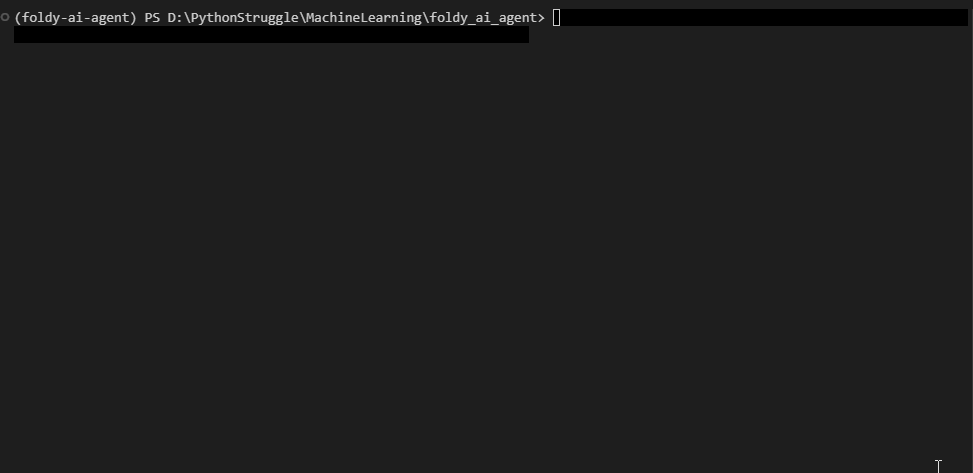

# Foldy AI Agent



## Overview

Foldy is a lightweight local AI agent powered by a local LLM (Phi-4 via `llama.cpp`) that can manage files inside a secure sandbox using natural language commands.

It uses a ReAct-style architecture (Reasoning + Acting) built with LangGraph and runs fully locally — no external API required.

---

## Installation

### 1. Clone the repository

```bash
git clone <your-repo-url>
cd foldy_ai_agent
```

### 2. Install dependencies

```bash
uv pip install -e .
```

### 3. Download the model
```bash
mkdir models

uv run huggingface-cli download microsoft/phi-4-mini-instruct-gguf \
phi-4-mini-instruct-q4_k_m.gguf \
--local-dir models \
--local-dir-use-symlinks False
```

### 4. Start the local LLM server
```bash
uv run python -m llama_cpp.server \
--model models/phi-4-mini-instruct-q4_k_m.gguf \
--n_gpu_layers -1 \
--chat_format phi3 \
--n_ctx 2048
```

### 5. Run Foldy
- CLI usage:

```bash
uv run foldy "List all files in my folder"
```

```bash
uv run python -m src.cli.main "Create a file explaining the Turing Test"
```

## Architecture

Foldy uses a ReAct agent loop implemented with LangGraph:
- Agent Node: Interprets user input and generates tool calls
- Tools Node: Executes filesystem operations inside ./sandbox
- Observation Loop: Tool outputs are fed back into the model for reasoning and final response generation

## Sandbox Security

Foldy is restricted to the ./sandbox directory.

## Example Commands

```bash
foldy "How many files that start with 'video_' do I have in my folder"
foldy "Create a file named notes.txt with explanation how to tie shoelaces"
foldy "Delete all files that start wiht letter 'r'"
```

## Notes
- Fully local execution (no external APIs)
- You need to be really strict and explicit in your prompts. The model is small.
